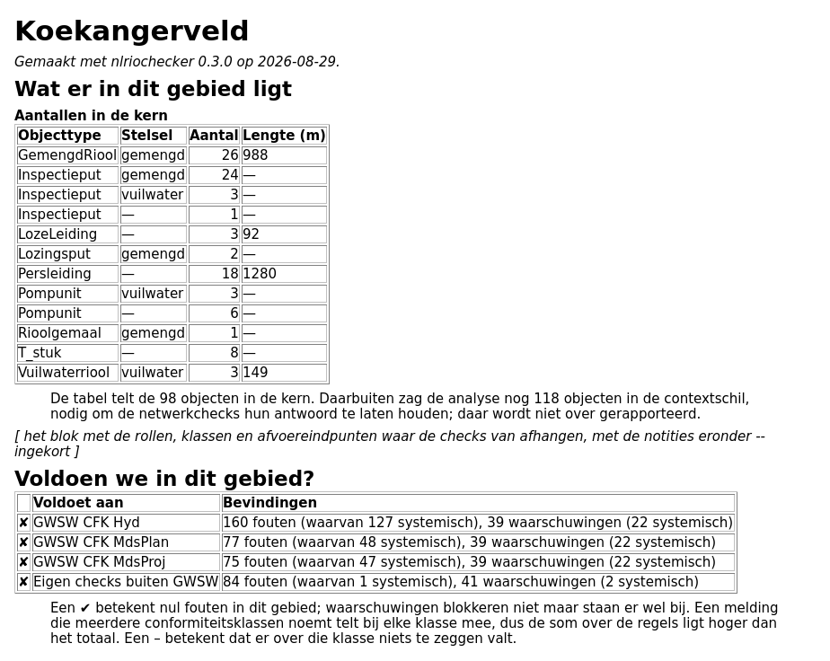

# nlriochecker

nlriochecker toetst de datakwaliteit van vrijvervalriolering in een GWSW-OroX-export (TTL). Het leest de
GWSW-nulmeting in (de SHACL-rapporten van [apps.gwsw.nl](https://apps.gwsw.nl/item_validate_shacl)) en voert
daarnaast een eigen checkregister uit op de dataset zelf en op externe bronnen (BGT, BAG, NWB, TOP10NL, AHN).
Het resultaat is een rapport per gebied en een kaart die je in QGIS opent.

[](https://github.com/mcolee/nlriochecker/actions/workflows/toets.yml)
[](LICENSE)
[](pyproject.toml)

## Stand van zaken

Het programma is bruikbaar, maar nog in ontwikkeling.

- **Fase 4.** Het inlezen van de nulmeting, de dekkingsanalyse, de trendvergelijking en de eigen checks op de
  OroX-dataset (ADM, ATTR, BTR, HGT, NET, RVZ, TOP) zijn af. De EXT-checks tegen externe bronnen zijn in bewerking.
- **Getest op één export**, die van De Wolden en Hoogeveen (bijna 47.000 objecten). Andere gemeenten en andere
  beheerpakketten zijn nog niet geprobeerd.
- **Niet op PyPI.** De API en de CLI-opties kunnen nog veranderen. Alleen `bevindingen.json` heeft een eigen
  schemaversie. Het versienummer en de wijzigingen staan in [CHANGELOG.md](CHANGELOG.md).

## Wat je krijgt

Eén `toets` schrijft vier bestanden. Ze komen uit dezelfde meldingenstroom en bevatten dus dezelfde meldingen.

**`bevindingen.md`** is het rapport. Het begint met het gebied: wat er ligt, of het aan de drie conformiteitsklassen
voldoet, de belangrijkste signalen en wat er niet is bekeken. Daarna volgen de tabellen per SHACL-vorm en per eigen
check. [Meer](docs/gebruik.md#het-bevindingenrapport).



**`bevindingen.csv`** bevat elke melding als rij, met check-ID, ernst, object, gebied, locatie en boodschap.

**De GeoPackage** (`dq_<dataset>_<datum>.gpkg`) zet de bevindingen op de kaart. In de lagen `putten` en `strengen`
heeft elk object een kleur naar status: rood bij een fout, oranje bij alleen waarschuwingen, groen als er geen eigen
gebrek is, grijs als het niet is beoordeeld. De laag `vlakken` bevat de rest: geraakte panden, watergangen, gemengde
deelstelsels en beoordeelde wegvakken. De opmaak (`layer_styles`) en de popup zitten in het bestand
([meer](docs/gebruik.md#wat-je-in-qgis-ziet)).


**`bevindingen.json`** bevat dezelfde meldingen in een vast, geversioneerd formaat voor verdere verwerking
([docs/json-schema.md](docs/json-schema.md)). Met `--uitvoer` kies je welke bestanden je wilt; het rapport wordt
altijd geschreven ([meer](docs/gebruik.md#uitvoer)).

## Snel proberen

In de repository zit een compleet voorbeeld: de buurt Koekangerveld in de gemeente De Wolden, met de OroX-uitsnede,
de drie SHACL-rapporten, het studiegebied en de externe bronnen. Het draaien kost drie commando's en enkele seconden:

```bash
uv tool install git+https://github.com/mcolee/nlriochecker
git clone https://github.com/mcolee/nlriochecker.git && cd nlriochecker
nlriochecker toets \
  --dataset voorbeelden/koekangerveld/koekangerveld_orox.ttl \
  --shacl voorbeelden/koekangerveld/gwsw_shacl_report_conformiteit_Hyd.csv \
  --shacl voorbeelden/koekangerveld/gwsw_shacl_report_conformiteit_MdsPlan.csv \
  --shacl voorbeelden/koekangerveld/gwsw_shacl_report_MdsProj.csv \
  --studiegebied voorbeelden/koekangerveld/cbs_buurt_koekangerveld_studiegebied.gpkg \
  --bronnen voorbeelden/koekangerveld \
  --output uitvoer/voorbeeld
```

Je hebt [uv](https://docs.astral.sh/uv/) nodig. De leeslaag komt uit git via `[tool.uv.sources]`; pip en pipx
kennen die instelling niet. De uitvoer ziet er zo uit (ingekort; in werkelijkheid staat er een regel per check):

```
koekangerveld_orox.ttl: 109 knooppunten, 107 strengen
  Analyseset: 98 objecten in de kern, 118 in de contextschil, van 216 in de export.
  ADM-010   F      2 bevindingen
  ...
  TOP-022   F      3 bevindingen
Totaal 84 fouten, 41 waarschuwingen uit de eigen checks; 201 overtredingen uit de nulmeting (162 fouten, 39 waarschuwingen)
Geschreven: uitvoer/voorbeeld/bevindingen.md
Geschreven: uitvoer/voorbeeld/bevindingen.csv
Geschreven: uitvoer/voorbeeld/dq_koekangerveld_orox_20260829.gpkg
Geschreven: uitvoer/voorbeeld/bevindingen.json
```

Samen 337 meldingen in vier bestanden. Het hoogteraster (AHN) is te groot voor de repository en zit er niet bij;
HGT-001 tot en met HGT-003 melden daarom dat ze niets konden toetsen. De herkomst en de licenties van de voorbeelddata
staan in [voorbeelden/koekangerveld/README.md](voorbeelden/koekangerveld/README.md): de OroX-export van De Wolden is
met toestemming gepubliceerd, BGT, BAG, NWB en GWSW zijn CC0, TOP10NL is CC-BY 4.0 (Kadaster).

## Met je eigen data

1. **De OroX-export** van je areaal: het GWSW-uitwisselbestand (TTL) uit je beheerpakket.
2. **De drie SHACL-rapporten** van de GWSW-nulmeting op diezelfde export, gemaakt met
   [apps.gwsw.nl](https://apps.gwsw.nl/item_validate_shacl), één per conformiteitsklasse (Hyd, MdsPlan, MdsProj). Alle
   drie zijn verplicht. Wil je er minder toetsen, dan geef je dat op met `--cfk`; het rapport vermeldt dat dan
   ([meer](docs/gebruik.md#toetsen-op-een-deelverzameling-conformiteitsklassen)).
3. **Een map met externe bronnen** voor de EXT-checks (`--bronnen`): BGT, BAG, NWB, TOP10NL en het AHN-raster. Welke
   bestanden en laagnamen het programma verwacht staat onder `[bronnen]` in de projectconfiguratie. Elke bron wordt
   vóór de eerste check gecontroleerd op dekking van je gebied ([meer](docs/gebruik.md#externe-bronnen-en-hun-dekking)).
4. **Een projectconfiguratie** met je eigen drempels en bronpaden (`--projectconfig`; voorbeeld:
   `configs/dewoldenhoogeveen.toml`). Dit bestand vervangt de standaardconfiguratie helemaal. Er is geen overlay, dus
   begin met een volledige kopie van `src/nlriochecker/checks.toml` ([meer](docs/gebruik.md#projectconfiguraties)).

Rapporteren per buurt of wijk doe je met `--studiegebied`, eventueel beperkt met `--gebied`. Zie [Rapporteren per
gebied](docs/gebruik.md#rapporteren-per-gebied) en [Eisen aan het studiegebiedbestand](docs/gebruik.md#eisen-aan-het-studiegebiedbestand).

## Verder lezen

- **[docs/gebruik.md](docs/gebruik.md)**: de gebruiksaanwijzing, met onder meer
  [de commando's `analyseer`, `dekking`, `toets` en `vergelijk`](docs/gebruik.md#de-commandos), [`toets` en de
  ontologie](docs/gebruik.md#toets-en-de-ontologie), [de nulmeting](docs/gebruik.md#de-nulmeting-tussen-de-eigen-bevindingen)
  en [de voortgangsbalk](docs/gebruik.md#voortgang).
- **[docs/architectuur.md](docs/architectuur.md)**: het OroX-grafmodel, de afbakening, de meldingenstroom en de GeoPackage.
- **[data/checkregister-gwsw-nulmeting-v0_9.md](data/checkregister-gwsw-nulmeting-v0_9.md)**: elke check met conditie, ernst, dimensie en herkomst.
- **[docs/dekkingsmatrix.md](docs/dekkingsmatrix.md)**: welke check op welke objecten werkt en wat hij leest.
- **[docs/json-schema.md](docs/json-schema.md)**: het formaat van `bevindingen.json`.
- **[docs/versionering.md](docs/versionering.md)**: hoe een nieuwe versie wordt uitgebracht.
- **[docs/beslislog.md](docs/beslislog.md)**: de vastgelegde besluiten (de BO-nummers).

## Ontwikkelen

```bash
uv sync
uv run ruff check
uv run ruff format --check .
uv run mypy                                          # over src/nlriochecker
uv run pytest                                        # zware tests niet; `-m zwaar` wel
uv run --with pytest-cov pytest --cov=nlriochecker   # dekking, ondergrens 95%
```

Dezelfde vijf stappen draaien in CI bij elke push naar `main` of `dev` (`.github/workflows/toets.yml`) en bij een
uitgave (`scripts/uitgave.py`). Een schone kloon heeft de niet-getrackte delen van `data/` niet. De tests die daarop
leunen slaan dan over; CI controleert dat er genoeg tests overblijven en dat elke overgeslagen test een geldige reden
opgeeft. Die situatie speel je lokaal na met `uv run python scripts/runnerpoort.py`.

Het inlezen van de OroX-TTL zit niet in deze repository. Die leeslaag (dataset, graaf, geometrie, ontologie, cache,
voortgang) is de package [gwsw-orox-helpers](https://github.com/mcolee/gwsw-orox-helpers) (MIT), die ook de
GWSW-ontologie meelevert. Een nieuwe GWSW-versie betekent dus een release daar en een `uv lock` hier. De werkwijze en
de harde regels staan in [CLAUDE.md](CLAUDE.md); het uitbrengen van een versie in [docs/versionering.md](docs/versionering.md).

## Bijdragen

Meld een fout, een check die iets anders zou moeten meten of een export waarop het misgaat op de
[issuetracker](https://github.com/mcolee/nlriochecker/issues). Bespreek een pull request eerst in een issue: de
domeinregels komen uit het GWSW en het checkregister, en daar hoort het gesprek te beginnen.

## Licentie

Copyright © 2026 Martin Colee. Licensed under the EUPL.

Dit werk valt onder de [European Union Public Licence v1.2](LICENSE) (EUPL-1.2). Dat is een copyleft-licentie: wie
een aangepaste versie verspreidt of anderen toegang geeft tot de wezenlijke functionaliteit ervan (ook online, als
dienst), doet dat onder dezelfde licentie en levert de broncode mee. De EUPL is in 23 talen rechtsgeldig; de
[Nederlandse tekst](https://joinup.ec.europa.eu/collection/eupl/eupl-text-eupl-12) geldt evenzeer als de Engelse.
