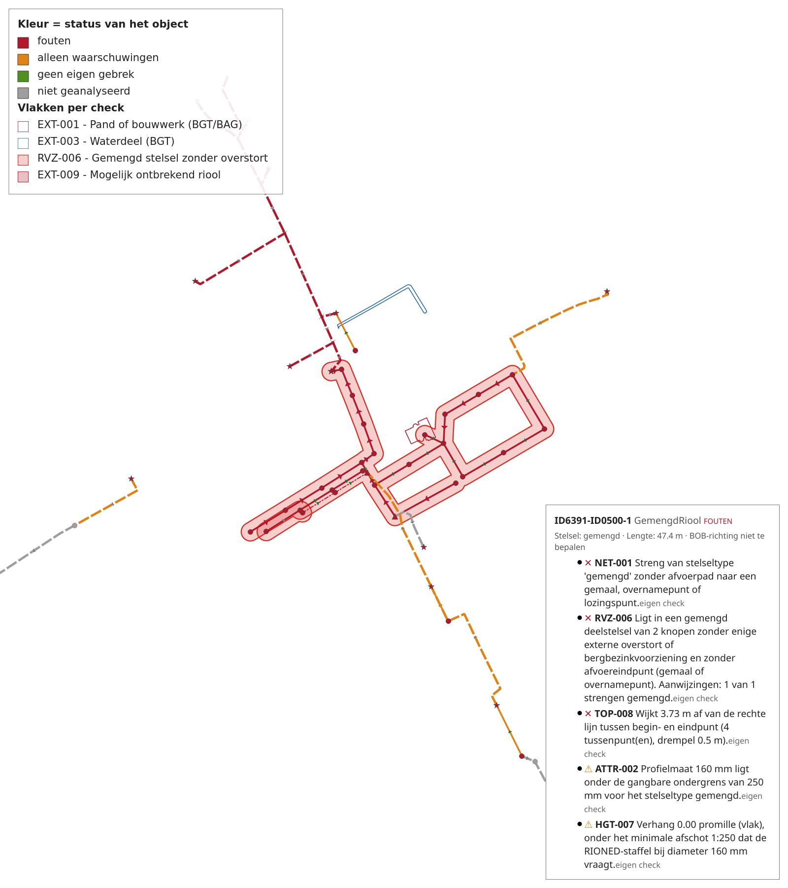

# Gebruik van nlriochecker

Hoe je de vier subcommando's draait, welke opties ertoe doen en wat er in de uitvoer
staat. De README is de landingspagina; dit document is de gebruiksaanwijzing. Voor de
werking onder de motorkap is [architectuur.md](architectuur.md) de naslag, en welke
controle waar vandaan komt staat in het
[checkregister](../data/checkregister-gwsw-nulmeting-v0_9.md) en in de
[dekkingsmatrix](dekkingsmatrix.md).

## Snel proberen met het voorbeeld

De repository draagt een compleet, klein voorbeeld: de buurt Koekangerveld in de gemeente
De Wolden, met de OroX-uitsnede, de drie SHACL-rapporten, het studiegebied en de externe
bronnen erbij. Herkomst, licenties en wat er wel en niet in zit staan in
[`voorbeelden/koekangerveld/README.md`](../voorbeelden/koekangerveld/README.md).

```bash
nlriochecker toets \
  --dataset voorbeelden/koekangerveld/koekangerveld_orox.ttl \
  --shacl voorbeelden/koekangerveld/gwsw_shacl_report_conformiteit_Hyd.csv \
  --shacl voorbeelden/koekangerveld/gwsw_shacl_report_conformiteit_MdsPlan.csv \
  --shacl voorbeelden/koekangerveld/gwsw_shacl_report_MdsProj.csv \
  --studiegebied voorbeelden/koekangerveld/cbs_buurt_koekangerveld_studiegebied.gpkg \
  --bronnen voorbeelden/koekangerveld \
  --output uitvoer/voorbeeld
```

Er hoeft geen `--projectconfig` bij: het voorbeeld draait op de meegeleverde
`src/nlriochecker/checks.toml`. Wat je ziet, ingekort tot de hoofdregels -- er staat een
regel per check, plus een regel over de cache en een waarschuwing dat het net in dit
gebied met vrijwel de hele export samenhangt:

```
koekangerveld_orox.ttl: 109 knooppunten, 107 strengen
  Externe bronnen: 7 lagen, bereik cbs_buurt_koekangerveld_studiegebied:buurt_gegeneraliseerd.
    Niet aanwezig: bgt_putdeksel (lagen put bevatten geen features)
    Niet aanwezig: ahn_dtm (voorbeelden/koekangerveld/ahn5_dtm_koekangerveld.tif)
  Studiegebied cbs_buurt_koekangerveld_studiegebied:buurt_gegeneraliseerd (43.2 ha): 390 bevindingen buiten het gebied weggelaten.
  Analyseset: 98 objecten in de kern, 118 in de contextschil, van 216 in de export.
  ADM-010   F      2 bevindingen
  ...
  TOP-022   F      3 bevindingen
Totaal 84 fouten, 41 waarschuwingen uit de eigen checks; 201 overtredingen uit de nulmeting (162 fouten, 39 waarschuwingen)
Geschreven: uitvoer/voorbeeld/bevindingen.md
Geschreven: uitvoer/voorbeeld/bevindingen.csv
Geschreven: uitvoer/voorbeeld/dq_koekangerveld_orox_20260829.gpkg
Geschreven: uitvoer/voorbeeld/bevindingen.json
```

Vier bestanden dus, en samen 337 meldingen in `bevindingen.json` (de eigen bevindingen,
de nulmeting en de datasetsignalen). De naam van de GeoPackage draagt de rundatum, dus
die verschilt bij jou.

Twee bronnen ontbreken, en dat scheelt maar één ding. Het **hoogteraster** (AHN) is te
groot voor een repository; HGT-001 tot en met HGT-003 melden daarom zelf dat ze niets
konden toetsen. De **BGT-putdekselaag** is leeg in dit extract, maar geen enkele check
leest die rol nog sinds EXT-005 en EXT-006 vervielen: zij wordt alleen nog geladen en op
dekking getoetst, en haar ontbreken slaat niets over.

## De commando's

De nulmeting inlezen en samenvatten. De dataset moet altijd aan alle drie de
conformiteitsklassen getoetst zijn, dus geef alle rapporten mee:

```bash
nlriochecker analyseer \
  --shacl data/shacl_nulmeting/gwsw_shacl_report_conformiteit_Hyd.csv \
  --shacl data/shacl_nulmeting/gwsw_shacl_report_conformiteit_MdsPlan.csv \
  --shacl data/shacl_nulmeting/gwsw_shacl_report_MdsProj.csv \
  --output uitvoer
```

Dat levert `samenvatting.md` en `geaggregeerde_meldingen.csv`.

De eigen checks uit het checkregister op de OroX-dataset draaien:

```bash
nlriochecker toets \
  --dataset data/gwsw_orox_ttl/dewoldenhoogeveen_orox.ttl \
  --shacl data/shacl_nulmeting/gwsw_shacl_report_conformiteit_Hyd.csv \
  --output uitvoer
```

Verder: `nlriochecker dekking` toetst de nulmeting tegen het checkregister
(`dekking.md` en `dekking.csv`), en `nlriochecker vergelijk --eerder ... --later ...`
zet twee meetmomenten naast elkaar voor de trend (`vergelijking.md`, `verschillen.csv`
en `objectverschillen.csv`). Elk subcommando kent `--help`.

## `toets` en de ontologie

De GWSW-ontologie hoef je niet aan te wijzen: zij reist mee met de leeslaagpackage
[gwsw-orox-helpers](https://github.com/mcolee/gwsw-orox-helpers), en zonder `--ontologie`
laadt `toets` die gebundelde versie. Met `--ontologie <pad>` (meermaals toegestaan) kies je
een eigen ontologie; dat gaat dan voor. Die terugval geldt alleen voor `toets`:
`analyseer --dataset` zonder `--ontologie` berekent de typeringsscore met een afsluiting
die op de kale wortelklassen blijft steken, zonder voorbehoud.

Wat er bij `toets` niet gebeurt, is doorlopen zónder klassenhierarchie. De OroX-export
typeert niet op wortelniveau -- er staat `Inspectieput` in en geen `Put` -- en draagt geen
`rdfs:subClassOf`. Zonder de klassenhierarchie leveren `putten()` en `leidingen()` dus
een lege verzameling. De checks draaien dan over een onvolledige selectie en hun
uitkomst draagt geen oordeel, terwijl het rapport dat nergens zei.

Hoe onvolledig verschilt per check, en één cijfer eromheen misleidt dus. Gemeten op de
export van De Wolden en Hoogeveen zonder ontologie (29-08-2026): van de 89 checks zien er
**63 nul objecten** -- dat zijn de checks die op `putten()`, `leidingen()` of
`vrijvervalrioolleidingen()` selecteren, en die wortels dekken zonder hierarchie niets. De
veertien die het meest zien, zien er 767 van de 23.485 knooppunten, omdat `netwerkknopen`
naast de wortels ook klassen opsomt die de export wél rechtstreeks typeert; de overige
twaalf zitten daartussen. 767 is dus een bovengrens en geen gemiddelde. De kolom *Bekeken*
in het rapport zegt het per check.

Wie zo'n run bewust wil, geeft `--geen-ontologie` mee. Dan loopt hij door, maar draagt
elk rapport het voorbehoud in de kop, blijft de regel van de eigen checks in de
managementsamenvatting op `–` staan (met haar tellingen in de toelichting: er is wel
iets gevonden, maar het draagt geen oordeel), en meldt de verantwoording hoeveel
objecten de ontologische route wel en niet opleverde.

## Toetsen op een deelverzameling conformiteitsklassen

Standaard moet de dataset aan alle drie de klassen getoetst zijn en faalt de pijplijn bij
een ontbrekend rapport. Met `--cfk` kies je expliciet een deelset:

```bash
nlriochecker analyseer \
  --shacl data/shacl_nulmeting/gwsw_shacl_report_conformiteit_Hyd.csv \
  --cfk Hyd \
  --output uitvoer
```

De optie staat op `analyseer`, `dekking`, `toets` en `vergelijk`, mag meermaals mee, en
accepteert alleen klassen uit `vereiste_cfk` in de projectconfiguratie. Een rapport voor
een klasse buiten de keuze is een fout, geen stille overslag.

Elke afwijking van de volle set wordt gemarkeerd: een waarschuwingsregel boven elk
Markdown-rapport, en de velden `cfk_set` en `volledig` in de tabel `gwsw_run` van de
GeoPackage en in de JSON-envelop. `vergelijk` weigert twee meetmomenten met ongelijke
sets, want een daling die uit een kleinere getoetste set komt is geen verbetering.

Gelden er meer runbrede voorbehouden tegelijk -- een deelset op een run met
`--geen-ontologie` -- dan komen ze allebei in die kop te staan; `uitvoer/voorbehoud.py`
stelt ze samen en de kolom `markering` in `gwsw_run` en het gelijknamige veld in de
JSON-envelop dragen dezelfde tekst. Diezelfde `markering` verschijnt ook als het
nulmeting-kopblok een meldingenlimiet noemt (de GWSW-server kan de meldingtabel hebben
afgekapt, waardoor de toets een ondergrens telt) of een bestand met lokale
kwaliteitseisen (er zijn dan vormen bijgemeten die niet uit het GWSW komen). Beide staan
er alleen bij afwijking van de neutrale waarden `onbeperkt` en `geen`. Deze twee
kopblokvoorbehouden verschijnen alleen in `toets`; `analyseer`, `dekking` en `vergelijk`
tonen de twee kopblokvelden nog niet en zwijgen er dus over.

`bevindingen.csv` draagt de markering **niet**: de CFK-set hoort bij de run en niet bij
elke melding. Twee CSV's uit een volle en een deelrun zijn daardoor aan het bestand zelf
niet te onderscheiden. Lees zo'n CSV naast het rapport of de JSON van dezelfde run.

Een `toets` zonder `--shacl` meldt dat er niet tegen de conformiteitsklassen gemeten is.
Dat is een eigen toestand, los van "volledig" en van "deelset".

## De nulmeting tussen de eigen bevindingen

Met `--shacl` komen de SHACL-overtredingen zelf ook in de uitvoer terecht, naast de
bevindingen van de eigen checks en uit dezelfde meldingenstroom. Ze dragen
`Bron = nulmeting`, `Categorie = NULMETING` en een check-ID dat de SHACL-vorm noemt
(`NULMETING-LengteLeiding_val`). De kolom `CFK` -- in de JSON het veld `cfk` -- zegt welke
conformiteitsklassen de overtreding noemen.

Zo'n melding draagt twee teksten. De kolom `Melding` (in de JSON `boodschap`) is de
vastgestelde Nederlandse zin bij die SHACL-vorm -- "Streng waarvan het beginpunt niet aan
precies één put/knooppunt is gekoppeld" -- en de kolom `MeldingTechnisch` (in de JSON
`boodschap_technisch`) is de tekst van de GWSW-server zelf. Het rapport, de tabel per
SHACL-vorm en de popup op de kaart tonen alleen de zin; de CSV, de JSON en de
meldingentabel van de GeoPackage dragen ze allebei. Voor een vorm waarvoor nog geen zin
is vastgelegd blijft de technische tekst staan, en het rapport telt hoeveel meldingen dat
waren.

Dezelfde overtreding staat vaak in meerdere CFK-rapporten. Er komt er dan **een**, met
alle klassen erbij: de kaart en de kolom `n_fout` tellen gebreken, geen rapportregels.
Een telling per klasse telt zo'n melding bij elke genoemde klasse mee, dus de som over de
klassen ligt hoger dan het totaal.

De focusnode van een SHACL-melding is meestal een put of een streng, en anders een
onderdeel daarvan: het eindpunt van een leiding, de maaiveldorientatie van een put. Zo'n
onderdeel wordt via `hasPart`, `hasAspect` en als laatste `hasConnection` omhooggelopen
tot het object waar het bij hoort. Op De Wolden en Hoogeveen herleidt daarmee 99,5% van de
overtredingen tot een put of een streng. Komt de focusnode nergens op uit -- een
klassenaam uit `CfkTypes_typ`, een stelsel dat geen kaartobject is -- dan blijft de
melding staan zonder object, zonder plek op de kaart en met een leeg gebied. Het rapport
telt die gevallen expliciet, ook als het er nul zijn.

Op de De Wolden en Hoogeveen-export leveren de drie rapporten samen ruim 213.000 regels,
en na ontdubbeling 105.963 meldingen: 87.017 fouten en 18.946 waarschuwingen. Dat is geen
modelleerfout maar de uitslag van de nulmeting zelf; de zwaarste posten zijn drie
kardinaliteitsvormen die vrijwel elke inspectieput raken (puthoogte, bergend oppervlak en
maaiveldschematisering, elk ruim 20.700 keer). Precies daarvoor is de systemisch-vlag:
die zegt dat het over de export als geheel gaat en niet over een los gebrek. Dat aantal
is de telling vóór de onderdrukking uit `[rapport]`; met de projectconfiguratie van De
Wolden vallen er 8.513 nulmetingmeldingen weg (vooral op mechanisch riool) en houdt de
run er 97.450 over.

## Rapporteren per gebied

Met `--studiegebied` wordt de rapportage tot dat gebied beperkt. Bevat het bestand meer
dan een feature, dan rapporteert `toets` per feature:

```bash
nlriochecker toets \
  --dataset data/gwsw_orox_ttl/dewoldenhoogeveen_orox.ttl \
  --studiegebied data/gis_dewoldenhoogeveen/CBS_buurten_DeWoldenHoogeveen.gpkg \
  --output uitvoer
```

```
uitvoer/
  koekangerveld/     bevindingen.md, bevindingen.csv, bevindingen.json, dq_*.gpkg
  zuidwolde_noord/   idem
  totaal/            synthese.md, bevindingen.csv, bevindingen.json
```

De mapnaam is de gesaneerde `naam_gebied`: diakrieten eraf, lowercase, alles wat geen
letter of cijfer is naar een underscore. In de rapporten, de kolom `Gebied` en de JSON
blijft de originele naam staan.

Met `--gebied` beperk je de run tot een of meer gebieden (meermaals opgeefbaar, exacte
naam). Het volledige bestand wordt altijd eerst gevalideerd: een deelrun mag een defect
in een ander gebied niet maskeren. De synthese vermeldt dat het een selectie was en
hoeveel gebieden het bestand telde.

De dataset wordt ook bij tachtig gebieden precies een keer geladen, en per gebied wordt
een eigen kern, contextschil en uitgedunde dataset gebouwd. De meldingen van een gebied
zijn daardoor gelijk aan die van een losse run met alleen dat gebied; daar staat een
test op.

Een gebied zonder GWSW-objecten -- water, natuur, een bedrijventerrein op eigen beheer --
stopt een meervoudige run niet: het krijgt een eigen rapport met nul bevindingen en een
expliciete regel dat er niets te toetsen viel, en de synthese noemt het apart. Bij een run
op een enkel gebied blijft dat een harde fout, want daar is het bijna altijd een verkeerd
bestand of een verkeerde laag.

Een object dat meerdere gebieden raakt telt in elk rakend gebied mee -- elk gebied ziet
zijn eigen volledige werkelijkheid. Er wordt niet ontdubbeld. De totaalsynthese telt de
unieke meldingen en zegt hoeveel er in meer dan een gebied voorkomen, zodat de som der
delen verklaarbaar afwijkt van het totaal. In `totaal/` staat geen GeoPackage: de
featurelagen zijn per gebied afgebakend, en een unie ervan zou grensobjecten dubbel
bevatten of ze stilzwijgend ontdubbelen.

`analyseer`, `dekking` en `vergelijk` werken op de SHACL-rapporten en kennen geen
studiegebied. Wil je twee meetmomenten per gebied vergelijken, richt `vergelijk` dan op
de uitvoer van een gebied tegelijk: map tegen map.

### Eisen aan het studiegebiedbestand

GeoPackage of GeoJSON in EPSG:28992. De GeoPackage moet `srs_id = 28992` dragen; voor
GeoJSON, dat formeel alleen WGS84 kent, geldt een legacy `crs`-member die EPSG:28992
noemt, en anders moeten alle coordinaten binnen de RD-grenzen uit de projectconfiguratie
(`[drempels] rd_x_min` en verder) vallen. Buiten bereik is een harde fout met de melding
dat het bestand vermoedelijk in WGS84 staat.

Alleen `Polygon` en `MultiPolygon` worden geladen; een `GeometryCollection` wordt niet
uitgepakt. Overgeslagen typen worden geteld en gemeld -- in het logboek en in de
synthese. Blijft er geen enkel vlak over, dan faalt de run.

Vanaf twee features is een kolom of property `naam_gebied` verplicht: aanwezig, per
feature gevuld en uniek, en twee namen mogen niet dezelfde mapnaam opleveren. De mapnaam
`totaal` is gereserveerd voor de synthese en dus als gebiedsnaam verboden. Bij een
enkele feature is `naam_gebied` niet verplicht: is hij er, dan wordt hij de
gebiedsaanduiding, en anders geldt de terugval op `statcode`/`statnaam` of de laagnaam.

## Het bevindingenrapport

`bevindingen.md` leest van gebied naar detail:

1. **De naam van het gebied** als titel. Zonder studiegebied blijft de dataset de
   aanduiding; in `totaal/` heet de synthese "Totaal (N gebieden)".
2. **Wat er in dit gebied ligt:** een tabel objecttype x stelseltype over de kern, met bij
   de leidingen zowel het aantal als de meters. De contextschil staat als voetnoot en telt
   niet mee -- er wordt niet over gerapporteerd.
3. **Voldoen we in dit gebied?** Een regel per conformiteitsklasse plus een totaalregel
   voor de eigen checks. Een vinkje betekent **nul fouten**; waarschuwingen blokkeren niet
   maar hun aantal staat er wel bij, met tussen haakjes hoeveel er systemisch zijn. Is er
   op een klasse niet gemeten, dan staat er geen oordeel maar de reden.
4. **De rode draad**, als de bevindingen een gezamenlijke oorzaak hebben.
5. **De verantwoording:** wat er niet bekeken is, wat er buiten het gebied viel, welke
   bronnen ontbraken, en waaronder de rest gelezen moet worden.
6. **De detailrapportage** in twee blokken: eerst de GWSW-nulmeting per SHACL-vorm (fouten
   boven waarschuwingen, met de conformiteitsklassen erbij), dan de eigen checks (de
   foutchecks boven de waarschuwingschecks).

De verantwoording noemt ook wat er buiten de netwerkanalyse viel. Een vrijvervalstreng
telt daarin pas mee als hij aan beide zijden op een knoop uitkomt: een put, of een
hulpstuk met een telbare GWSW-functie (een T-stuk, een verloopstuk), dat als
doorgeefknoop meedoet. Een afsluit- of ontstoppingsstuk blijft een breuk, en de strengen
die daardoor buiten beeld vallen staan bij naam in het rapport.

## Uitvoer

`analyseer`, `dekking` en `vergelijk` schrijven Markdown en CSV. `toets` schrijft
daarnaast een GeoPackage met de bevindingen op locatie en `bevindingen.json` met de
volledige meldingenstroom. Met `--uitvoer csv|json|gpkg` (herhaalbaar; standaard alle
drie) kies je welke van die drie bijproducten er komen; het Markdown-rapport wordt altijd
geschreven, want het draagt de markering en het voorbehoud. Dat
JSON-bestand is een geversioneerd contract voor machinale verwerking; zie
[json-schema.md](json-schema.md). `--output` staat standaard op `uitvoer/`.
Invoerbestanden worden nooit overschreven.

De GeoPackage draagt drie featurelagen, een per geometrievorm: `putten` (punt),
`strengen` (lijn) en `vlakken` (vlak). De twee objectlagen dragen de gebreken *op* het
object. Elk object draagt een kolom `status` met vijf waarden --
`rood` bij een fout, `oranje` bij alleen waarschuwingen, `groen` als er geen eigen gebrek
is, `grijs` als er niet beoordeeld is, en `geaccepteerd` als elke bevinding op het object
via `[rapport] uitzonderingen` bewust aanvaard is -- en een kolom `popup_html` met de
voorgebakken hoverpopup. Mechanisch riool staat tussen de strengen met status `grijs`: het
objecttype klopt, alleen is er niets getoetst. Met een studiegebied staat de contextschil
er ook grijs bij, zodat de kaart niet bij de gebiedsgrens ophoudt alsof daar niets ligt. De
popup zegt per grijs object waarom.

`status` telt systemische meldingen niet mee, net als `ergste_ernst`, `n_fout` en
`n_waarschuwing`. Een object waarvan álle meldingen systemisch zijn is dus groen; dat
betekent "geen gebrek dat dit object van zijn buren onderscheidt", niet "in orde". De
kolom `n_systemisch` en de popup zeggen het er allebei bij.

Alle meldingen staan in de tabel `meldingen`, joinbaar op `feature_id`, met de
foutlocatie in de kolommen `x` en `y`. Er is geen laag met losse meldingpunten; wie de
exacte plek van een melding op een lijn -- het snijpunt van een kruising, het midden van
een streng -- als punt op de kaart wil, maakt er in QGIS een geometriegenerator van.

De derde laag, `vlakken`, draagt alles wat bij de uitslag hoort en geen punt of lijn is.
De kolom `soort` houdt de bronnen uit elkaar:

- **`pand`, `bouwwerk` en `water`** -- de externe objecten waarnaar de EXT-checks
  verwijzen: elk BGT-pand, BAG-pand of overig bouwwerk waarover EXT-001 meldt, en elk
  BGT-waterdeel waarover EXT-003 meldt. `relatie` en `afstand_min_m` gelden alleen voor
  pand en bouwwerk.
- **`gemengd_deelstelsel`** -- een vlak om elk gemengd deelstelsel waarop RVZ-006
  aansloeg, als buffer om de vrijvervalstrengen van de samenhangende component. De popup
  noemt de omvang van het deelstelsel, het aandeel gemengde strengen erin en de overige
  aanwijzingen die de check vond.
- **`wegvak`** -- een vlak per NWB-wegvak dat EXT-009 beoordeelde. Dit is de enige soort
  die ook zonder melding een rij krijgt: de kolom `status` scheidt de straat waar
  riolering ligt (`groen`) van de straat die de regel niet beoordeelt (`grijs`, met de
  reden in de popup) en van het gemelde wegvak (`rood`).

Al die rijen komen uitsluitend uit de meldingen van díé uitvoer -- op de groene en grijze
wegvakken na, die uit het beoordelingsregister van de run komen. Wat erin staat is dus
exact wat de check gemeld heeft, niet meer en niet minder. Kruisingen mét geregistreerde
zinker of duiker blijven er buiten, en bij rapportage per gebied bevat elk gebied alleen
zijn eigen treffers. De laag bestaat altijd, ook leeg.

### Wat je in QGIS ziet

De GeoPackage brengt haar eigen opmaak mee (tabel `layer_styles`), dus openen volstaat.



Het symbool zegt wat voor GWSW-object het is -- de indeling komt uit de PDOK-SLD's -- en
de kleur zegt uitsluitend hoe het ervoor staat: rood bij een fout, oranje bij alleen
waarschuwingen, groen als er geen eigen gebrek is, grijs als er niet beoordeeld is, en een
warme grijstint als de bevindingen geaccepteerd zijn. Rood
is duidelijk donkerder dan groen, zodat de twee ook in grijstinten en bij kleurenblindheid
uit elkaar te houden zijn. Een objecttype dat de symbolentabel niet kent krijgt een
vangnetsymbool met het legendalabel "objecttype niet in de symbolentabel"; er is geen
stille default.

Een streng draagt daarbovenop een richtingpijl: groen als het BOB-verval met de getekende
lijn meeloopt, **rood en omgekeerd** als het daar tegenin loopt -- de pijl wijst dan waar
het water werkelijk heen loopt -- en grijs als de richting niet te bepalen is. Een
persleiding krijgt altijd de grijze pijl, ook als zij een BOB-verval draagt: zij is
pompgestuurd, dus dat verval zegt niets over de stroomrichting. De popup zegt dat er ook
bij.

De laag `vlakken` heeft een legendaregel per check, met de checkcode voorop: EXT-001 voor
pand en bouwwerk samen, EXT-003 voor water, RVZ-006 voor het gemengde deelstelsel en
EXT-009 voor het gemelde wegvak. Het groene en het grijze wegvak van EXT-009 krijgen géén
stijlregel: met duizenden beoordeelde straten tegen een paar honderd gemelde was de kaart
niet meer te lezen. Ze blijven wel volledig als rij bestaan -- in de attributentabel, in
een filter en in de popup is dus nog steeds na te gaan of een straat bekeken is.

Hoveren over een object toont een popup met het label, het GWSW-type, de status en tot
vijf meldingen, elk met ernst-symbool, check-ID, boodschap en herkomst (`nulmeting ·
MdsPlan` of `eigen check`). Bij een streng staan ook het stelsel, de lengte en de
BOB-richtingsregel erin; bij een grijs object waarom het niet beoordeeld is. Systemische
meldingen staan niet los in de popup: die worden geteld in een afsluitende regel.

> **Zet "Show Map Tips" aan.** QGIS toont map tips alleen als die knop in de werkbalk
> ingedrukt is (View → Show Map Tips, of het icoon met de gele tooltip). Staat hij uit,
> dan gebeurt er bij hoveren niets -- en dat leest als kapot terwijl het een instelling is.

De popup is opgemaakt met CSS. Een QGIS-bouw met QtWebKit toont hem zoals bedoeld; een
bouw zonder valt terug op een eenvoudiger tekstweergave waarin de opmaak wegvalt en de
velden tegen elkaar aan komen te staan. De inhoud blijft dan volledig, alleen minder
prettig te lezen.

Alle vier de uitvoervormen komen uit dezelfde meldingenstroom, dus ze kunnen niet uit
elkaar lopen. Elk geschreven bestand noemt waarmee het gemaakt is: de Markdown-rapporten
in een regel onder de titel, de CSV's in de kolom `Gereedschap`, de GeoPackage in het
veld `gereedschap` van de tabel `gwsw_run`, de JSON in het enveloppeveld `gereedschap`.
Een rapport is daarmee altijd te herleiden tot de versie die het opleverde.

## Externe bronnen en hun dekking

`--bronnen` wijst de map met BGT, BAG, NWB, TOP10NL en het AHN-raster aan. Welke bestanden
en laagnamen dat zijn staat in `[bronnen]` van de projectconfiguratie, samen met
`studiegebied`: de polygoon die het gebied afbakent waarvoor je die bronnen geldig
verklaart. Objecten daarbuiten krijgen geen EXT-uitslag maar de status *buiten
studiegebied*, en dat wordt geteld in het rapport.

Bij het laden wordt elke aangeleverde bron getoetst op dekking van dat bereik, voordat
er ook maar een check draait. Een laag die kleiner is dan het gebied waarvoor hij geldt
levert namelijk geen fout op maar stilte: de check draait, vindt niets, en dat leest
als "geen probleem". Een tekort is daarom een harde fout die per bron beide omhullenden
en het tekort per zijde noemt. De vectorlagen moeten het bereik plus de grootste
EXT-zoekafstand dekken; het raster alleen het bereik zelf, want bemonsteren is
puntsgewijs.

Wat die toets niet kan: een gat midden in een extract valt er niet mee op, en een
tekort op een dunne laag betekent "hier staan geen features" en niet per se "extract
afgeknipt". Daarvoor is `[bronnen] dekking_tolerantie_m`. De code staat standaard op
`0.0` (streng), maar de meegeleverde `checks.toml` zet hem voor de bronnen van
Koekangerveld op `300`: `bgt_bouwwerk` telt 52 objecten die aan de oostkant 276 m voor de
rand ophouden, wat aan die bron niets mankeert.

De tolerantie geldt voor alle lagen tegelijk. Dekt een enkele laag het gebied echt niet,
zet die laag dan uit in plaats van de tolerantie op te rekken: `bgt_waterlagen = []`
schakelt EXT-003 en EXT-007 uit met een uitleg in het rapport, terwijl een
tolerantie van kilometers de poort voor elke bron opheft.

## Projectconfiguraties

`configs/` bewaart de projectconfiguraties van de gebieden waarop dit project draait; geef
er een mee met `--projectconfig`. `configs/dewoldenhoogeveen.toml` hoort bij de bronnen in
`data/gis_dewoldenhoogeveen` en beslaat het hele gebied van de OroX-dataset. Zonder die
optie geldt de meegeleverde `src/nlriochecker/checks.toml`, die naar Koekangerveld wijst.

Let op: `--projectconfig` vervangt de configuratie in haar geheel; er is geen overlay. Een
projectconfiguratie is dus een volledige kopie van `checks.toml`, en een drempel die daar
verandert moet in elke kopie na.

### Geaccepteerde bevindingen

Een bevinding die na controle terecht blijkt te kloppen -- een tegenverhang dat echt zo
ligt, een riool onder een pand dat er hoort -- kun je **accepteren** zonder haar te laten
verdwijnen. `[rapport] uitzonderingen` wijst een los JSON-bestand aan (pad relatief aan de
projectconfig): één lijst van records met elk een verplichte `melding_id` (de machinesleutel
uit `bevindingen.csv` / de JSON) en `reden`, en optioneel `check_id`, `object_id`,
`waarde_snapshot`, `datum` en `wie`. Een geaccepteerde bevinding valt uit de foutentelling
van haar object -- op de kaart krijgt dat object de status `geaccepteerd` -- maar blijft
gewoon in het rapport, de CSV, de JSON en de meldingentabel staan. Het rapport en de
JSON-envelop (`uitzonderingen`) en de kolommen `uitzonderingen_bestand`,
`meldingen_geaccepteerd` en `uitzonderingen_zonder_bevinding` in `gwsw_run` verantwoorden
hoeveel er geaccepteerd zijn. Twee dingen worden luid gemeld en vervallen nooit vanzelf: een
`melding_id` uit het bestand dat de run niet meer oplevert ("uitzondering zonder bevinding"),
en een melding die nog bestaat maar een andere waarde draagt dan de `waarde_snapshot` -- die
wordt níét automatisch geaccepteerd en vraagt om herbeoordeling.

## Voortgang

`toets` toont bij de zware stappen een voortgangsbalk: het inlezen van de TTL's, het
inlezen van de SHACL-rapporten, het draaien van de checks (met het lopende check-ID) en
het wegschrijven van de GeoPackage. De balk gaat naar stderr, zodat de tellingen en de
geschreven paden op stdout schoon blijven voor wie de uitvoer doorpipet; buiten een
terminal valt hij terug op een enkele regel per fase.

Wie de package als library gebruikt, geeft een eigen implementatie van het protocol in
`gwsw_orox_helpers.voortgang` mee. Zonder argument gebeurt er niets: voortgang is weergave
en raakt de uitkomst van een run nergens.
